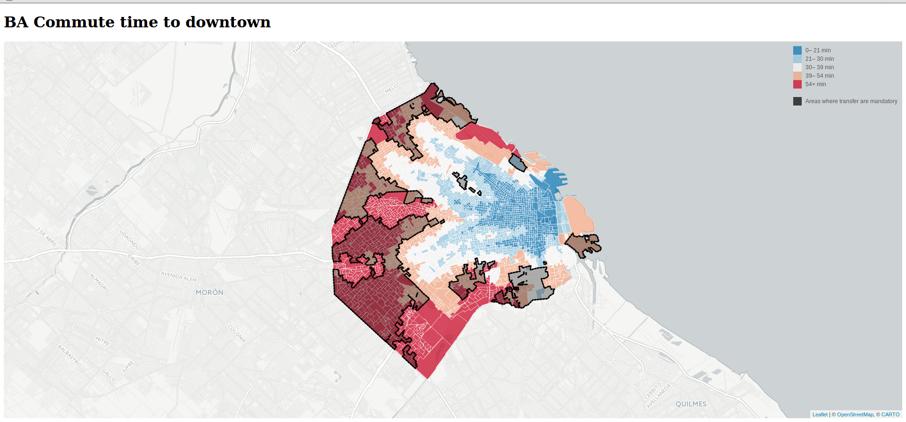

# baCommuteMatrixMap
A matrix map with the commute times for every census block for Buenos Aires City using Google API. Black zones are those where a transfer is mandatory.

[Click here](https://alephcero.github.io/baCommuteMatrixMap/) for the interactive version

## Dowtown
For downtown we used the following address: Peron 552. This address is approximately at the same distances from all subway lines.

## BA distance matrix in time to downtown by census block

Blue areas show the farthest blocks from downtown in trip's time

## BA distance matrix in cost to downtown by census block

Green areas show where the transfer cannot be avoided
